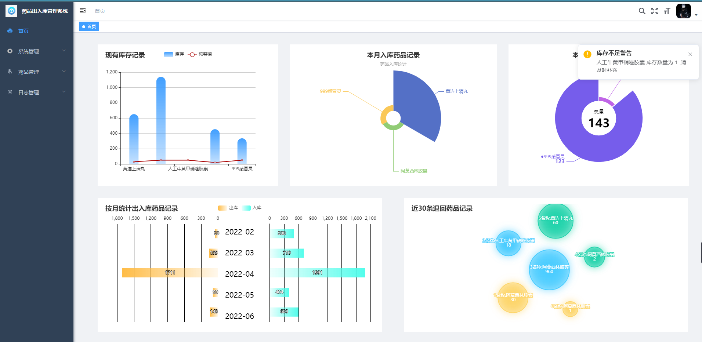
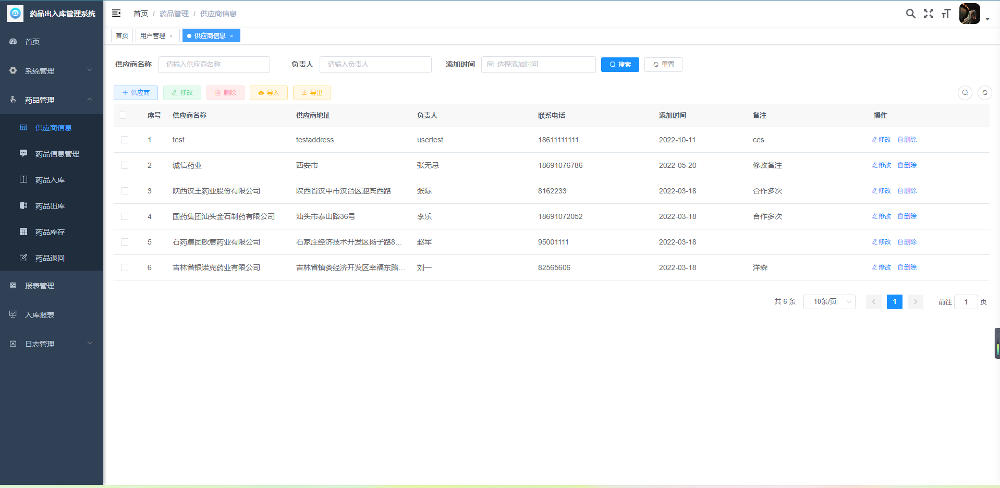
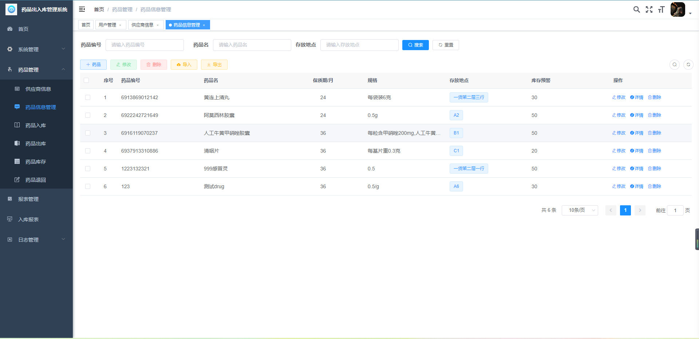
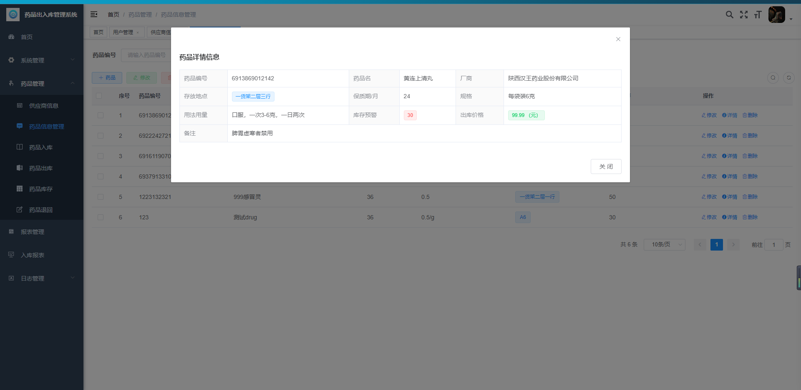
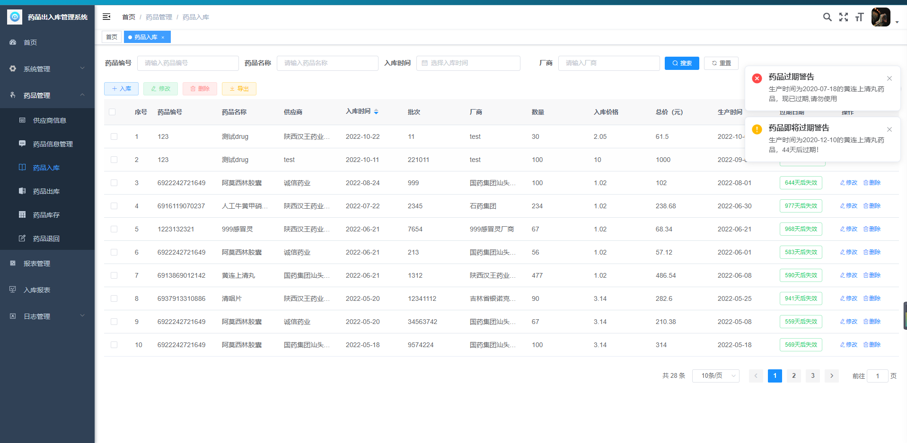
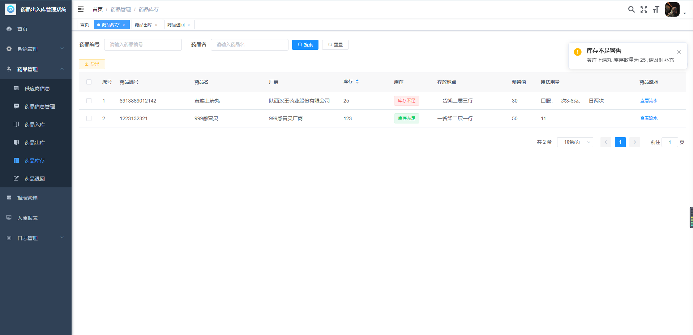
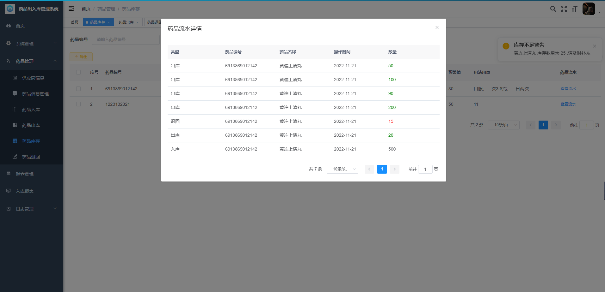
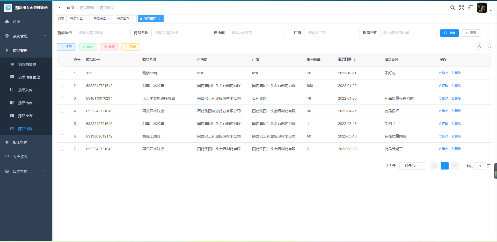

# 医院药品出入库管理系统

### 在线预览地址
http://39.101.133.125:1008
| 账号    | 密码     |
| -------- | -------- |
| test | admin123 |

##### 此账号为演示账号, 权限较低, 如果需要较高权限账号请联系作者
### 作者QQ：1556708905, (支持修改、 部署调试、 支持代做毕设)

#### 介绍
系统主要实现了供应商信息和药品信息的增、删、改、查、导入、导出的基本信息管理功能，以及药品入库、出库、退回和库存的管理功能，其中 药品入库时能实时的展示药品到期时间及对即将要过期和已过期药品进行系统 警告提示。
系统有药品管理员和超级管理员两种角色，药品管理员能管理药品，超级管理员除药品外还能进行用户管理，部门管理等以及日志查看管理。

#### 系统环境版本说明
JDK >= 1.8 

Mysql >= 5.7.0

Redis >= 3.0

Maven >= 3.0

Node >= 12

#### 使用说明

1、后端运行：

(1)将项目导入到IntelliJ IDEA中

(2)创建数据库ly，并执行ly.sql数据脚本

(3)修改数据库连接，编辑resources目录下的application-druid.yml，将数据库账号密码改为自己本地的

(4)配置redis编辑resources目录下的application.yml，可配置redis（默认无密码）

(5)启动redis后，再启动RuoYiApplication.java即可运行系统。

2、前端运行：

(1)cd ruoyi-ui

(2)使用npm install安装依赖（不建议通过cnpm或其它进行安装 可能会丢包）

(3)在终端使用npm run dev来启动项目

#### 系统演示

1.  登录（验证码功能已关闭，可开启验证码功能）。

登录包括两种不同的风格，一种是背景图，一种是`three.js`粒子动效。默认样式为背景图，若要更换则将`src/views/login1.vue`和`login.vue`文件名进行更改，让你想使用的样式的文件名为`login.vue`则可。（两个文件只能有一个名为`login.vue`,那个名为login.vue则就是那个样式）

2.  首页

3.  药品管理

  1） 药品供应商管理  

  2） 药品信息管理

  3） 药品入库管理

  4） 药品出库管理

  5） 药品库存管理

药品流水

  

6） 药品回退管理

4. 系统集成了积木报表（详情请访问积木[报表官网](http://www.jimureport.com/)）
   

   药品入库报表

   

